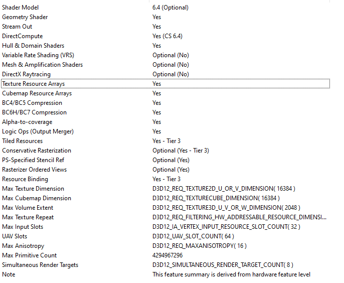
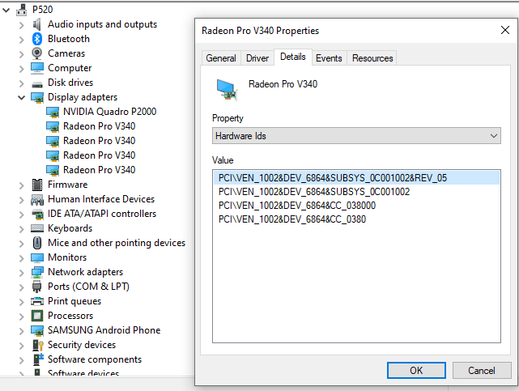
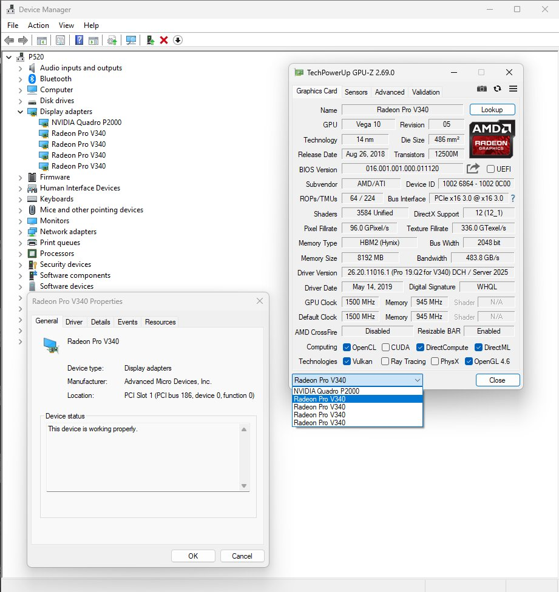

# v340l-windows-enablement

Enabling native LLM inference on the AMD Radeon Pro V340L (DEV_6864)
using the llama.cpp WebGPU backend with Radeon Pro Software Enterprise
19.Q2 on Windows 10 and Windows 11.

The card installs with a one-line INF edit. Driver signature enforcement
can be re-enabled after installation — the drivers survive reboot in
enforced mode. No permanent test mode watermark.

Each V340L die: 3584 shaders, 8 GB HBM2, 483.8 GB/s bandwidth, DirectX 12
Feature Level 12\_1, Shader Model 6.4. Two cards = four independent dies.

---

## Native Inference (WebGPU / D3D12)

Native Windows LLM inference is operational on a single die.

**Baseline — Qwen3.5-9B-Q3\_K\_S, single die:**

| Test | Result |
|---|---|
| Prompt Processing (pp512) | **20.40 t/s** |
| Token Generation (tg128) | **6.70 t/s** |

The working path is the llama.cpp **WebGPU + Google Dawn** backend, which
translates to D3D12 natively. The Vulkan backend is not viable: 19.Q2 lacks
the Vulkan 1.2 extensions llama.cpp requires.

If your primary display adapter lacks `ShaderF16` (e.g. NVIDIA Pascal), a
small patch is required so Dawn selects the V340L rather than the display GPU.
That patch is in ADDENDUM13.md and is upstream as
[llama.cpp PR #21744](https://github.com/ggml-org/llama.cpp/pull/21744).

---

## Why D3D12

The 19.Q2 driver exposes full D3D12 compute capability:



| Feature | Value |
|---|---|
| Feature Level | D3D12 FL 12\_1 |
| Shader Model | 6.4 (Wave Intrinsics, integer dot products) |
| DirectCompute | CS 6.4 |
| Resource Binding | Tier 3 |

Shader Model 6.4 on a 2019 enterprise driver on Vega 10 is not widely
documented. This is the first public confirmation via DirectX Caps Viewer
on the 19.Q2 driver.

---

## Driver Installation

### Step 1 — Temporarily disable driver signature enforcement

The INF edit below invalidates the catalog signature. A WHQL-signed driver
is being retargeted to a hardware revision it was not originally submitted
against. The underlying silicon is identical — this is a revision number
discrepancy, not a driver compatibility issue.

This is materially different from most INF modifications, which permanently
alter driver behavior or disable security checks. Here the only change is
the PCI revision ID string. Once Windows accepts the driver into the store
and binds it to the device, the driver is treated as any other installed
driver — signature enforcement can be restored immediately after installation.

```powershell
bcdedit /store B:\EFI\Microsoft\Boot\BCD /set {current} testsigning on
bcdedit /store B:\EFI\Microsoft\Boot\BCD /set {current} nointegritychecks on
shutdown /r /t 0
```

> `B:` is the EFI system partition. Adjust the drive letter if yours differs.

### Step 2 — Download the 19.Q2 driver

**Use 19.Q2 specifically.** Later driver versions crash at device polling
initialization when installed via the REV\_05 edit. The cause is a changed
hardware polling contract in newer drivers. Fixing that requires a KMDF shim
and is deferred. 19.Q2 is the only validated production path.

From AMD's support page (Windows 10 64-bit, listed under the ESXi 6.7 section):

[AMD Radeon Pro V340 Drivers](https://www.amd.com/en/support/downloads/drivers.html/graphics/radeon-pro/radeon-pro-v-series/radeon-pro-v340.html)

Select: **Radeon Pro Software Enterprise 19.Q2 for V340**

Direct link (as of April 2026):
```
https://drivers.amd.com/drivers/firepro/win10-64bit-radeon-pro-software-enterprise-19.q2-for-v340-june18.exe
```

Extract the package.

### Step 3 — The INF edit

The Stadia-production V340L cards report `REV_05`. The 19.Q2 driver INF
targets `REV_03`, which was the revision at driver release. Windows treats
a PCI revision mismatch as no compatible driver found.

The display driver INF is at:
```
Packages\Drivers\Display\WT6A_INF\U0343610.inf
```

Edit `U0343610.inf` only:

```powershell
$path = "path\to\Packages\Drivers\Display\WT6A_INF\U0343610.inf"
(Get-Content $path -Raw) -replace 'DEV_6864&REV_03','DEV_6864&REV_05' |
    Set-Content $path -NoNewline
```

The hardware reports the following IDs (Device Manager → Details → Hardware Ids):



```
PCI\VEN_1002&DEV_6864&SUBSYS_0C001002&REV_05
PCI\VEN_1002&DEV_6864&SUBSYS_0C001002
PCI\VEN_1002&DEV_6864&CC_038000
PCI\VEN_1002&DEV_6864&CC_0380
```

The INF match string after the edit becomes
`PCI\VEN_1002&DEV_6864&SUBSYS_0C001002&REV_05`, which matches the first
hardware ID exactly.

### Step 4 — Install via Device Manager

The dies appear as **Video Controller** with yellow warning icons under
Other devices.

1. Right-click → **Update driver** → **Browse my computer** →
   **Let me pick from a list** → **Have Disk**
2. Browse to `WT6A_INF` → select `U0343610.inf`
3. Select **Radeon Pro V340** (not MxGPU) → Next → accept the warning
4. Repeat for each die

Each die appears under Display adapters as **Radeon Pro V340**, Status OK,
no Code 43, no Code 10.

### Step 5 — Re-enable driver signature enforcement

```powershell
bcdedit /store B:\EFI\Microsoft\Boot\BCD /set {current} testsigning off
bcdedit /store B:\EFI\Microsoft\Boot\BCD /set {current} nointegritychecks off
shutdown /r /t 0
```

The drivers remain bound after reboot with enforcement re-enabled.

---

## Confirmed Working

| | |
|---|---|
| **Card** | AMD Radeon Pro V340L (ex-Google Stadia, SUBSYS\_0C001002, REV\_05) |
| **Host** | Lenovo ThinkStation P520 |
| **CPU** | Intel Xeon W-2145 |
| **OS** | Windows 10 IoT LTSC |
| **Driver** | Radeon Pro Software Enterprise 19.Q2 (26.20.11016.1) |
| **Cards tested** | 2 simultaneously (4 dies, all operational) |
| **Coexistence** | NVIDIA Quadro P2000 as primary display — no conflict |



### Per Die
- 56 Compute Units / 3584 Shaders
- 8192 MB HBM2 @ 945 MHz (483.8 GB/s)
- 1500 MHz GPU Clock
- OpenCL 2.0, Vulkan, OpenGL 4.6, DirectX 12 (FL 12\_1), DirectML
- PCIe x16 Gen3

### OpenCL Verified
```
Number of devices:    4
Name:                 gfx901
Max compute units:    56
Max clock frequency:  1500Mhz
Global memory size:   8573157376
Available:            Yes
Compiler available:   Yes
```

---

## Current Development: DirectPort Pipeline Parallelism

The card presents each die as an independent SR-IOV virtual function on a
separate PCI bus via the onboard Switchtec PFX 48xG3 crossbar. Standard
intra-process tensor parallelism bottlenecks on PCIe.

Active development targets the **DirectPort SDK** for multi-die scaling:
- One independent `llama-cli` process per die, pinned by DXGI LUID
- `D3D12_HEAP_FLAG_SHARED_CROSS_ADAPTER` NT Handles for zero-copy activation transfer
- `dp12_signal_fence` / `dp12_queue_wait` for GPU-native cross-die synchronization

Gate 19 (D3D12 `CrossNodeSharingTier` check) is the immediate next empirical step.

---

## SR-IOV / MxGPU / Virtual Functions

The SR-IOV activation path in BRIEF.md (Sections 7–8) remains valid for:
- Splitting each die into multiple virtual functions (DEV\_686C)
- Running multiple isolated VMs per die
- MxGPU time-sliced GPU scheduling

For using each die as a single undivided 8 GB GPU — inference, compute,
rendering — the INF edit is sufficient.

---

## The Switchtec

The Microsemi Switchtec PFX 48xG3 on the V340L is a transparent PCIe bridge.
Windows' inbox `pci.sys` handles it automatically. It routes lanes to the two
downstream dies. It does not gate or manage GPU access.

AMD suppressed the Switchtec management endpoint in firmware. There is no
host-visible MRPC surface. The switch is a patch panel, not a gatekeeper.

---

## Files

| File | Description |
|---|---|
| **ADDENDUM13.md** | Day 4 — WebGPU/D3D12 inference, SR-IOV topology, LUID patch, PR #21744 |
| **ADDENDUM12.md** | Day 3 — Native activation achieved. Full technical record. |
| BRIEF.md | SR-IOV activation research — register values, gate table, GPUIOV sequence |
| SWITCHTEC.md | Switchtec driver and MRPC findings (valid but not required for PF usage) |
| ADDENDUM10.md | Day 1 — Hardware reconnaissance, topology confirmed |
| ADDENDUM11.md | Day 2 — Switchtec driver bind, Code 10 resolved |
| SURVEYDDA\_OUTPUT.txt | Raw SurveyDDA output — PCIe topology |

---

## Community Resources

Threads and references on this hardware, for anyone researching the V340L.
Listed roughly by relevance to Windows enablement.

**INF fix / Windows driver (independent discovery)**
- [Proxmox Forum — Shared GPU for VDI: Radeon Pro V340](https://forum.proxmox.com/threads/shared-gpu-for-vdi-radeon-pro-v340.170416/)
  kowmangler, Aug 2025 — independently found the REV\_03→REV\_05 INF edit for
  Windows guest driver in a Proxmox/VFIO passthrough context.

**Windows vBIOS flash approach (different path, useful reference)**
- [AMD Community — Help getting modified Radeon Pro V340L to work in Windows 10](https://community.amd.com/t5/pc-graphics/help-getting-modified-radeon-pro-v340l-to-work-in-windows-10/m-p/746264)
  cgavaller2, Mar 2025 — cross-flash to Vega 56 vBIOS, SR-IOV findings.
  *Note: The AMD community forum hosting this thread was sunset shortly after.*
- [Overclockers Forums — Radeon Pro V340L: Looking for BIOS Mod Info](https://www.overclockers.com/forums/threads/radeon-pro-v340l-looking-for-bios-mod-info.806968/)
  Aug 2025 — community attempt to preserve the vBIOS flash knowledge after AMD
  forum shutdown.

**Linux inference**
- [Level1Techs — Help getting a Radeon V340L working](https://forum.level1techs.com/t/help-getting-a-radeon-v340l-working/238322)
  Oct 2025 — ROCm + llama.cpp on Linux, ~2 t/s. Useful baseline for comparing
  native Windows D3D12 performance.

**General V340 / MxGPU discussion**
- [Level1Techs — AMD Radeon Pro V320/V340 Questions](https://forum.level1techs.com/t/amd-radeon-pro-v320-v340-questions/183773)
  2022 — SR-IOV and MxGPU viability questions, largely unanswered at the time.
- [Level1Techs — Hybrid GPU Architecture: Radeon Pro 9700 + Three Radeon Pro V340s](https://forum.level1techs.com/t/hybrid-gpu-architecture-radeon-pro-9700-three-radeon-pro-v340s/243320)
  Dec 2025 — multi-card V340 AI inference workload discussion under Linux.

**Hardware reference**
- [ServeTheHome — AMD Radeon Pro V340 Launch Teardown](https://www.servethehome.com/amd-radeon-pro-v340-dual-vega-32gb-vdi-solution-launched/)
  2018 — physical teardown, PCB photos, Switchtec identification.

---

## License

MIT
